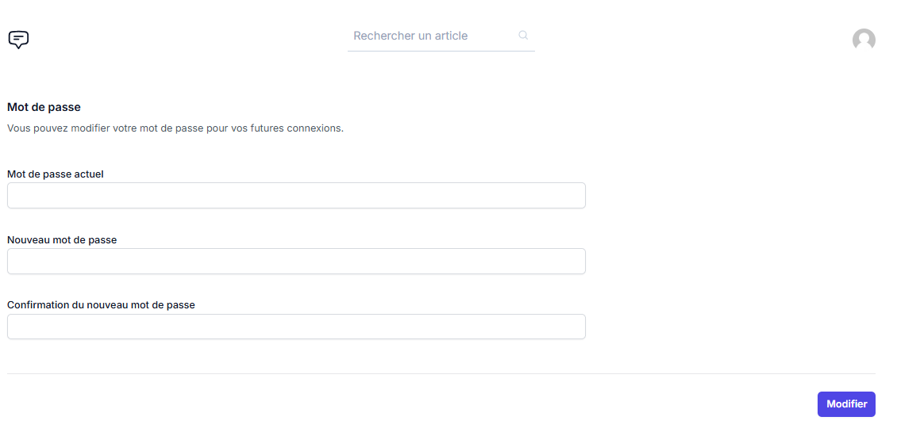

# Blog avec Laravel

## Objectif

Le but était de découvrir et explorer, dans un premier projet, les nombreuses possibiltés liées à l'utilisation de Laravel. Parmi ces dernières que j'ai pu expérimenter dans ce premier projet :
- Création d'une interface d'administration pour pouvoir :
    - Créer de nouveaux posts
    - Modifier des posts existants
    - Effacer des posts
- Création d'un formulaire d'inscription + login pour des utilisateurs du site
- Permettre d'écrire des commentaires en bas de chaque article
- Afficher les articles sur la page d'accueil
- Faire apparaitre les articles sélectionnés de manière dynamique

## Ressources
 - Formation vidéo de **Tiret_du_bas**
 - Livre **Laravel : un frameword efficace pour développer vos applications PHP - edition ENI**

## Technos utilisées
 - Laravel
 - Tailwind Css
 - AlpineJS
 - Vite

 ## Résultat

